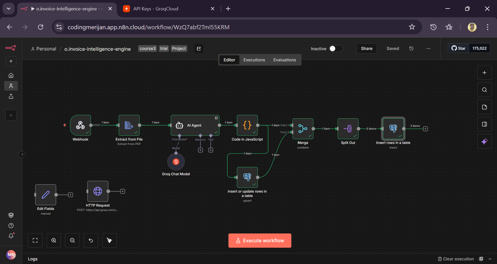
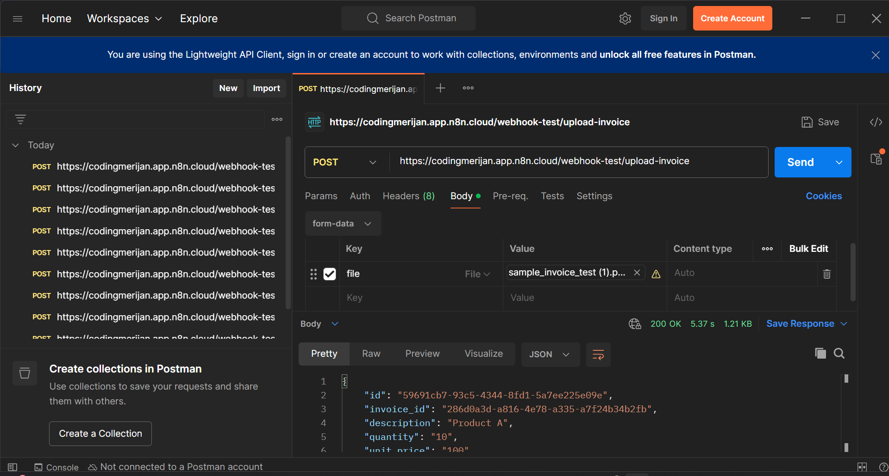
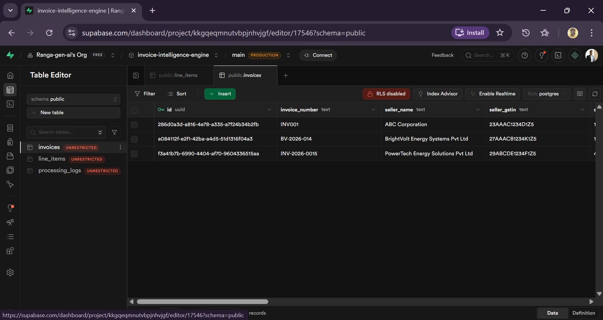
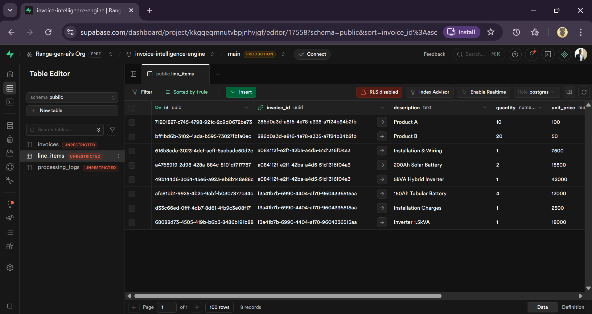

# AI-invoice-intelligence-engine
AI workflow system for automated invoice parsing, structured data extraction, and relational storage using n8n, Groq LLM, and PostgreSQL.
           

AI-powered invoice ingestion and structuring pipeline built using n8n, Groq LLM, and PostgreSQL (Supabase).

## 🚀 What This Demonstrates

- Practical LLM integration inside operational workflows
- Deterministic structured extraction from unstructured documents
- Relational schema design with foreign key integrity
- Real-world automation architecture using n8n + PostgreSQL
- Production-aware design (idempotency, latency logging)

## Overview

This system ingests invoice PDFs, extracts text, converts unstructured invoice data into structured JSON using an LLM, and stores it in a relational database with proper header–line item integrity.

The system is designed as an AI-assisted financial data ingestion layer for operational workflows.

---
### 1️⃣ Master Workflow View

## Architecture

Webhook (PDF Upload)
→ Text Extraction
→ LLM-Based Structuring (Groq)
→ JSON Parsing & Validation
→ PostgreSQL Insert (Invoice Header)
→ Relational Insert (Line Items)
→ Processing Logs

---

## Database Structure

### invoices
Stores structured invoice header data.

- id (UUID)
- invoice_number
- seller_name
- seller_gstin
- invoice_date
- customer_name
- subtotal
- gst_amount
- total_amount
- created_at

### line_items
Stores line-level invoice breakdown.

- id (UUID)
- invoice_id (Foreign Key → invoices.id)
- description
- quantity
- unit_price
- line_total
- created_at

### processing_logs
Tracks execution metadata.

- id (UUID)
- invoice_number
- status
- error_message
- latency_ms
- created_at
 
but in this workflow have not captured metadata and kept it basic upto first two tables. will do polishing and upgrading soon.
---

## Key Features

- PDF-based invoice ingestion
- AI-powered structured data extraction
- Relational database storage
- Invoice → Line Item linkage via foreign key
- Execution latency tracking
- Idempotent invoice_number constraint

---

## Technologies Used

- n8n (Workflow Automation)
- Groq LLM (llama-3.1-8b-instant)
- PostgreSQL (Supabase)
- JavaScript (Node Code Nodes)
- REST Webhooks

---

## Design Decisions

- UUID primary keys for distributed-safe identity
- Unique invoice_number to prevent duplicates
- Separation of header and line items for normalization
- Human-readable structured JSON before DB insert
- Modular workflow architecture

---

## Limitations

- No raw PDF storage (v1)
- No confidence scoring
- No dashboard UI
- No duplicate content detection beyond invoice_number

---

## Future Enhancements

- Add raw PDF object storage
- Add duplicate detection layer
- Add financial analytics dashboard
- Add API retrieval endpoints
- Add token usage tracking
- Add retry/error handling queue

---
### 2 Postman sending files to webhook listening

### 3 invoices table / line items tables with invoices data 

## Author
MOHANARENGAN KRISHNARAJA

AI Automation Engineer  
Systems-focused workflow design & LLM integration
